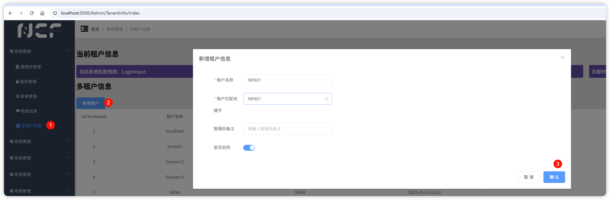
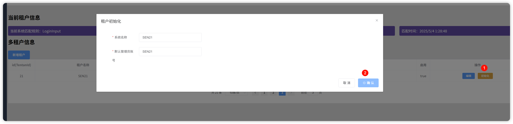
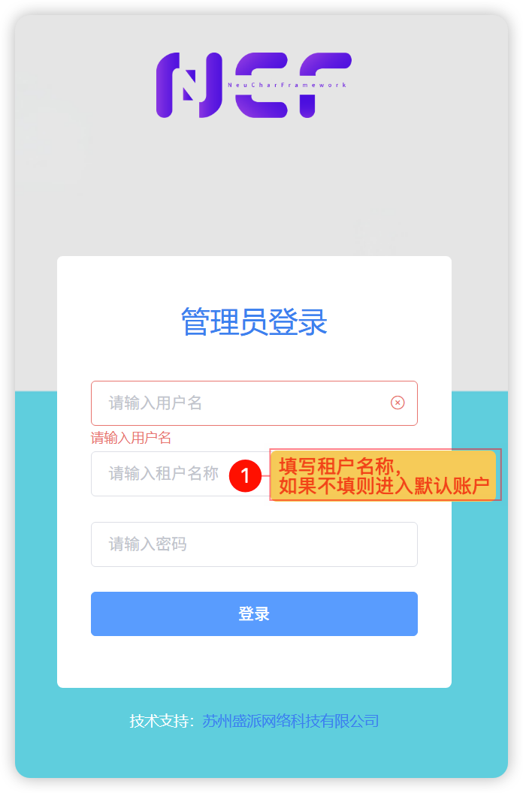
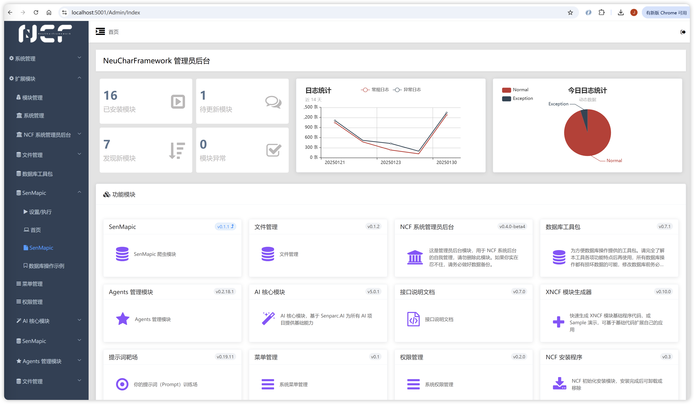

# 日志

## 2026-09-06更新

NcfPackageSources（Developer-MAF-V3 分支）——后台体验、AIKernel 可观测性、站点防护与 NeuBell WebHook 通知：

1、NeuBell WebHook（WebAPI）通知设置（Senparc.Areas.Admin）：管理员可为纽铃（NeuBell）添加 WebHook 通知端点，按 Provider 过滤（留空为全部 Provider）。当任一纽铃 Provider 的条目发生新增（added）或移除（removed）时，系统以异步方式（fire-and-forget，`SemaphoreSlim(4)` 限制并发出站）POST 通知，不阻塞业务请求与 Footer 刷新。每条设置支持：新增/移除分别开关、启用开关、可选 HMAC-SHA256 签名密钥（请求携带 `X-NeuBell-Signature: t=<unix>,v1=<hex>`，`v1 = HMAC-SHA256(secret, t + "." + body)`）；管理页"测试"按钮发送 `kind=test` 事件验证连通性。数据表 `ADMIN_NeuBellWebHook`（Sqlite / SqlServer / MySql / Dm / Oracle / PostgreSQL 六库迁移已同步）；后台 `IHostedService` 监测循环（`NeuBellWebHook:PollingIntervalSeconds` 配置轮询间隔，默认 30 秒、最小 5 秒，并订阅纽铃变更事件提前唤醒）按 Provider 基线做差异对比：首次观测只建基线避免重启误报，Provider 本轮缺席但仍在开放列表（快照获取失败）时保留基线，模块被关闭才将存量条目按"移除"通知。管理入口：页脚"纽铃"抽屉 → "WebHook 设置"（`/Admin/NeuBell/Index`，仅超级管理员）。

2、AIKernel：Token 用量监测——实时聚合 + 按运行异步进度；AI 模型列表页直接展示用量。

3、后台菜单：左侧菜单新增搜索过滤；菜单"配置模式"支持拖拽调整一级菜单（如 XNCF）顺序，保存后真实更新存储的 Sort 数值。

4、Provits（NeuCharPivot）：支持逐个创建 Provit，支持通过 AI Chat 创建或修改；可创建"Provit Panel"面板并绑定到特定页面（如后台首页 `admin-home`），面板组合来自任意 XNCF 模块的 Provit Block，支持拖拽排序与 AI 辅助编辑块。

5、Admin Chat：新增可选的"长任务（Harness）"模式，基于 Microsoft Agent Framework（MAF）多步骤自主执行——步数预算、超时控制、`[[DONE]]` 完成标记识别，执行步骤返回前端展示；默认仍为普通对话模式。

6、站点防护：Senparc.Web 新增 `CloudflareProtect` SystemConfig 配置节（默认关闭）。开启后，自用户打开网站（首个请求）起立即生效固定窗口限流与安全响应头。

完整模块清单见 [NCF 核心能力详解](../NcfPackageSources/home/capability-guide.md)，升级注意事项见 [版本升级说明](../NcfPackageSources/home/version-upgrade-notes.md)。


## 2026-08-30更新

NcfPackageSources（Developer-MAF-V3 分支）各 XNCF 模块功能文档同步更新，主要内容：

1、NeuCharWorkflow（0.1.0-preview1，XncfOrder 5890）：服务端工作流编排能力成体系——可视化设计器与布局管理、版本管理与自动保存、运行回放（事件/快照持久化、加载更多事件）、Webhook 触发、并行节点（并发执行下游分支）、Human Input 人工输入节点（外部恢复 resume）、NeuBell 通知消费、Workflow 分析（Analytics）页面；模板表达式绑定与校验、观测输出 Schema；全局 NeuCharPivot 悬浮调用（`AllowGlobalPivot` 特性控制角色级访问）。

2、AgentsManager（0.3.22）：A2A（Agent-to-Agent）远程智能体支持——远程智能体接入/发布管理、ChatGroup 上下文共享（可配置）、`AgentTemplateRunner` 统一本地与 A2A 智能体执行、已发布 A2A 智能体手动 Prompt 执行与部署模型回退机制；`AgentModelRequestDiagnostics` 模型请求诊断（敏感数据脱敏）；线程管理引入取消令牌实现优雅停机。

3、新增模块：
- `Senparc.Xncf.Sandbox`（0.1.0-preview1）：独立沙箱编排，Docker/Wasm 快速创建/销毁隔离实验环境，支持配额/TTL、JupyterLab、csharp-exec（.NET 10）、持久化 Lab 工作区文件上传/下载，与 XncfBuilder Preview Host 解耦。
- `Senparc.Xncf.DesktopBridge`（0.2.1-preview2）：为 NCF 桌面伴侣应用提供受保护的 HTTP/SSE 桥接：能力发现、活动快照、授权资源变更同步流、一次性 PKCE 会话交接；以 `NCF_DESKTOP_BRIDGE_TOKEN` 作为启动安全边界。
- `Senparc.Xncf.Dapr`（0.0.1）：Dapr 客户端抽象，提供服务调用（GET/POST/PUT/PATCH/DELETE）、Pub/Sub 发布、状态读写删除、健康检查与序列化抽象。
- 新增一批 Abstractions 契约包：`AIKernel.Abstractions`、`AgentsManager.Abstractions`（0.3.0）、`NeuCharWorkflow.Abstractions`（0.2.0）、`PromptRange.Abstractions`（0.2.5-preview5）、`Sandbox.Abstractions`（0.2.0）、`MCP.Abstractions`，用于跨模块契约与集成事件抽象。

4、FirmwareUpdate 扩展为 NCF Host 与 NCF Desktop 双安装包镜像（`wwwroot/NcfPackages/host` 与 `/desktop`），提供独立下载清单、下载源选择（自动/本地/GitHub）与 MD5 指纹展示。

5、其他：`SystemManager` 1.1.3、`XncfBuilder` 0.10.3（Preview Host 进程级模块预览）、`FileManager` 0.6.0；PromptRange 新增 API 文档 XML（ApiDocXML）。

详细模块清单见 [NCF 核心能力详解](../NcfPackageSources/home/capability-guide.md)，升级注意事项见 [版本升级说明](../NcfPackageSources/home/version-upgrade-notes.md)。


## 2026-08-29更新

NcfPackageSources（Developer-MAF-V3 分支）发布更新，主要内容：

1、AgentsManager 支持 Human-in-the-Loop（人工介入）：任务可配置人工审批、最大对话轮次与工具权限；新增独立 `AgentExecutionTask` 管理、AgentTemplate 模型绑定与空输出 token 重试，Agent 编辑器支持新窗口打开。

2、NeuCharWorkflow 新增全局 NeuCharPivot 悬浮调用（`AllowGlobalPivot` 特性控制访问权限）、Workflow 分析页面（按日期 / 工作流 / 状态筛选并生成摘要）、Human Input 人工输入节点（用户输入提示与外部恢复）；时间戳统一为 `DateTimeOffset`，`AbortRun` 支持按执行日志 ID 中止，回放支持加载更多事件。

3、稳定性与诊断：新增 `AgentModelRequestDiagnostics` 模型请求诊断（敏感数据自动脱敏），表达式引擎 JSON 序列化完整保留非 ASCII 字符，ChatGroupService 独立 scope 执行并优化 token 逻辑。

4、版本更新：XncfBuilder 模板 `1.1.7`、Senparc.Ncf.Database `0.21.8-preview8`；下载页支持选择下载源（自动 / 本地 / GitHub）并展示 MD5 指纹；NCF Desktop 更新至 `0.10.1-build10066`。

详细升级说明见 [NcfPackageSources 版本升级说明](../NcfPackageSources/home/version-upgrade-notes.md)。


## 2025-05-04更新

1、添加租户（还没做名称唯一性判断）



2、初始化租户（还没做重复生成判断）：



3、完成后可获得新租户的默认管理员账号密码，从登录页面输入即可登录：



> 注意：
> 1、appsettings.json 有变化，需要设置："TenantRule": "LoginInput" （之前为 DomainName）
> 2、已经安装完的系统，需要在 Senparc.Web/App_Data 目录下，新建一个文件：install_finished.txt（内容无所谓）

## 2025-01-31更新

NCF v0.28.0 发布，更新了包括 Senparc.AI 在内的基础库，同时更新了后台首页



源码已经更新，也可以直接安装体验，https://www.nuget.org/packages/Senparc.NCF.Template/0.28.0

## 2025-01-24更新

Senparc.AI 最新版本已经发布；NeuCharAI 的 function calling 能力已经接通。

## 2025-01-22更新

Senparc.AI 最新版本已经支持 DeepSeek，NCF 的 AIKernel 下一个版本也会同步支持 UI。目前测试 DeepSeek V3的 function call 有点问题，谨慎使用。明天晚上周会我会演示带有 Function Call 功能的多智能体，接下去就可以让机器人自动做所有事情了。

## 2025-01-09更新

NCF 基础模块和模板都有更新，对 XNCF 生成过程全部重构了，解决了XNCF 模块生成时候的中文支持问题，另外增加了 XNCF 模块的默认达梦数据库迁移

## 2024-12-27更新

CO2NET 3.1.0 正式版已经发布，这是第一个 3.0 之后的正式版。

## 2024-12-23更新

NCF 模板新版本发布：v0.27.3 优化单元测试，提供最新的种子数据（Seed Data）注入方法演示，实现无外部数据库支持下的数据读写和操作测试。

## 2024-12-21更新

NCF 模板更新，提供菜单设置页面的父层节点置顶，解决菜单项过长，不容易编辑的问题。

## 2024-12-19更新

https://doc.ncf.pub 搜索功能已经上线

## 2024-12-08更新

Senparc.AI Sample 已经支持 GPT-4o 的图片识别能力（Developer-Vision 分支）：

## 2024-11-17更新

Aspire 的分支已经发布：https://github.com/NeuCharFramework/NCF/tree/Developer-Aspire

## 2024-11-15更新

Senparc.AI.Agents已经发布了新版本，AutoGen 作者一起 PR 了一个 Sample 过来，之前说的问题已经解决了

## 2023-04-21更新

```
Senparc.AI v0.1.4-beta1 新版本发布
添加对话聊天、Embedding  Sample
后续将开始接入 Senparc.Weixin SDK，敬请关注！
开源地址：https://github.com/Senparc/Senparc.AI

Sample 使用介绍：
https://github.com/Senparc/Senparc.AI#%E5%91%BD%E4%BB%A4%E8%A1%8C%E4%BD%BF%E7%94%A8%E8%AF%B4%E6%98%8E
```

## 2023-03-10更新

```
ChatGPT + Dall·E + 盛派微信 SDK +NeuCharFramework，实现模块化架构基础上的微信机器人（群）方案，将会全部开源，即插即用。

```

## 2023-03-06更新

```
Senparc.Xncf.OpenAI 模块最新版本已经发布：https://www.nuget.org/packages/Senparc.Xncf.OpenAI/0.1.4-beta1

加载到 NCF 项目后，可以通过 Swagger 测试接口（本地测试建议使用源码，去掉Jwt锁），接下来将发布基于微信对话的 Demo，完全开源，请关注开源项目：

Xncf.OpenAI模块：https://github.com/NeuCharFramework/Senparc.Xncf.OpenAI

微信SDK：https://github.com/JeffreySu/WeiXinMPSDK
```

## 2021-08-01更新

    1.更新发布xncf包到nuget
    2.增加配置
    3.增加配置数据库
    4.增加配置多租户
    5.更新名词解释
    6.增加配置Redis
    7.完善指定数据库
    8.完善更新基础库
    9.完善Xncf 中实现自己的业务逻辑
    10.完善进阶开发

## 2021-07-20更新

    1.更新多数据库支持
    2.更新多数据库切换
    3.更新多数据库原理
    4.更新日志
    5.更新常见问题

## 2020-09-20更新

    NCF已经发布新的beta5，本次更新了底层的数据库、重构了数据库同步的方法、更新了文档模块，如果新项目建议用新的模板，老项目可以手动更新数据库，步骤：
    1、更新最新NCF项目代码
    2、将 `Senparc.Service` 项目设为启动项目
    3、在 【程序包管理器控制台】选中 `Senparc.Service` ，然后输入：`update-database  -Context SenparcEntities` 回车
    4、完成。无需其他操作。
