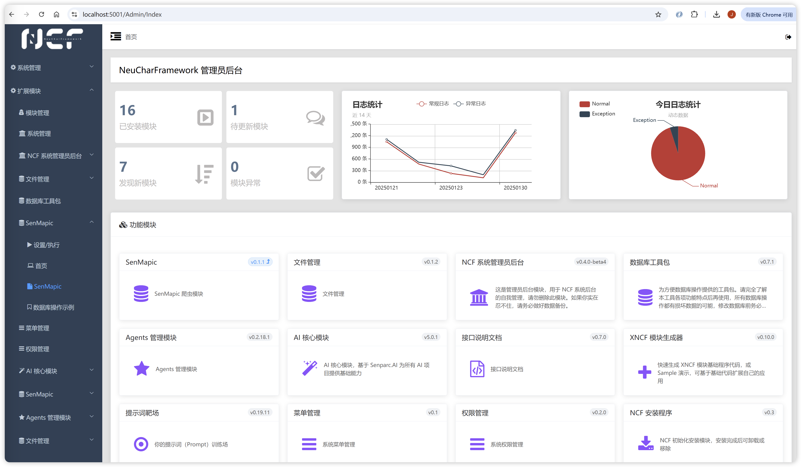

# 日志

## 2025-01-31更新

NCF v0.28.0 发布，更新了包括 Senparc.AI 在内的基础库，同时更新了后台首页



源码已经更新，也可以直接安装体验，https://www.nuget.org/packages/Senparc.NCF.Template/0.28.0

## 2025-01-24更新

Senparc.AI 最新版本已经发布；NeuCharAI 的 function calling 能力已经接通。

## 2025-01-22更新

Senparc.AI 最新版本已经支持 DeepSeek，NCF 的 AIKernel 下一个版本也会同步支持 UI。目前测试 DeepSeek V3的 function call 有点问题，谨慎使用。明天晚上周会我会演示带有 Function Call 功能的多智能体，接下去就可以让机器人自动做所有事情了。

## 2025-01-09更新

NCF 基础模块和模板都有更新，对 XNCF 生成过程全部重构了，解决了XNCF 模块生成时候的中文支持问题，另外增加了 XNCF 模块的默认达梦数据库迁移

## 2024-12-27更新

CO2NET 3.1.0 正式版已经发布，这是第一个 3.0 之后的正式版。

## 2024-12-23更新

NCF 模板新版本发布：v0.27.3 优化单元测试，提供最新的种子数据（Seed Data）注入方法演示，实现无外部数据库支持下的数据读写和操作测试。

## 2024-12-21更新

NCF 模板更新，提供菜单设置页面的父层节点置顶，解决菜单项过长，不容易编辑的问题。

## 2024-12-19更新

https://doc.ncf.pub 搜索功能已经上线

## 2024-12-08更新

Senparc.AI Sample 已经支持 GPT-4o 的图片识别能力（Developer-Vision 分支）：

## 2024-11-17更新

Aspire 的分支已经发布：https://github.com/NeuCharFramework/NCF/tree/Developer-Aspire

## 2024-11-15更新

Senparc.AI.Agents已经发布了新版本，AutoGen 作者一起 PR 了一个 Sample 过来，之前说的问题已经解决了

## 2023-04-21更新

```
Senparc.AI v0.1.4-beta1 新版本发布
添加对话聊天、Embedding  Sample
后续将开始接入 Senparc.Weixin SDK，敬请关注！
开源地址：https://github.com/Senparc/Senparc.AI

Sample 使用介绍：
https://github.com/Senparc/Senparc.AI#%E5%91%BD%E4%BB%A4%E8%A1%8C%E4%BD%BF%E7%94%A8%E8%AF%B4%E6%98%8E
```

## 2023-03-10更新

```
ChatGPT + Dall·E + 盛派微信 SDK +NeuCharFramework，实现模块化架构基础上的微信机器人（群）方案，将会全部开源，即插即用。

```

## 2023-03-06更新

```
Senparc.Xncf.OpenAI 模块最新版本已经发布：https://www.nuget.org/packages/Senparc.Xncf.OpenAI/0.1.4-beta1

加载到 NCF 项目后，可以通过 Swagger 测试接口（本地测试建议使用源码，去掉Jwt锁），接下来将发布基于微信对话的 Demo，完全开源，请关注开源项目：

Xncf.OpenAI模块：https://github.com/NeuCharFramework/Senparc.Xncf.OpenAI

微信SDK：https://github.com/JeffreySu/WeiXinMPSDK
```

## 2021-08-01更新

    1.更新发布xncf包到nuget
    2.增加配置
    3.增加配置数据库
    4.增加配置多租户
    5.更新名词解释
    6.增加配置Redis
    7.完善指定数据库
    8.完善更新基础库
    9.完善Xncf 中实现自己的业务逻辑
    10.完善进阶开发

## 2021-07-20更新

    1.更新多数据库支持
    2.更新多数据库切换
    3.更新多数据库原理
    4.更新日志
    5.更新常见问题

## 2020-09-20更新

    NCF已经发布新的beta5，本次更新了底层的数据库、重构了数据库同步的方法、更新了文档模块，如果新项目建议用新的模板，老项目可以手动更新数据库，步骤：
    1、更新最新NCF项目代码
    2、将 `Senparc.Service` 项目设为启动项目
    3、在 【程序包管理器控制台】选中 `Senparc.Service` ，然后输入：`update-database  -Context SenparcEntities` 回车
    4、完成。无需其他操作。
