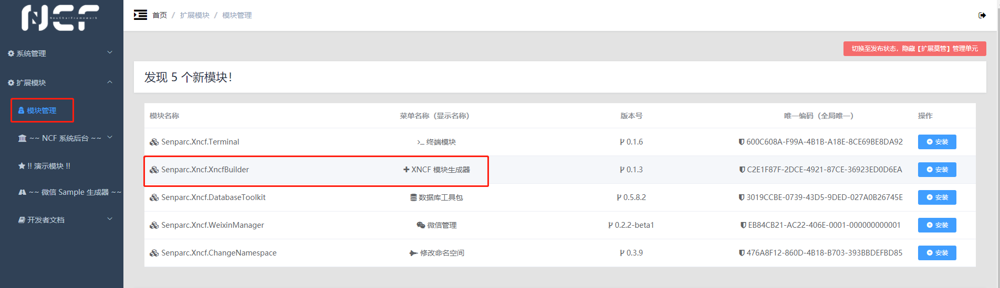
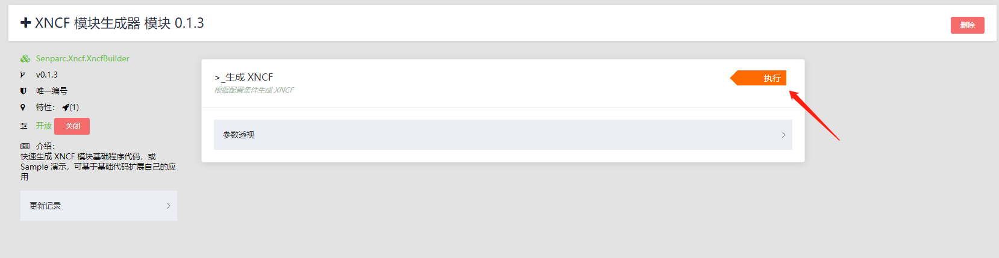
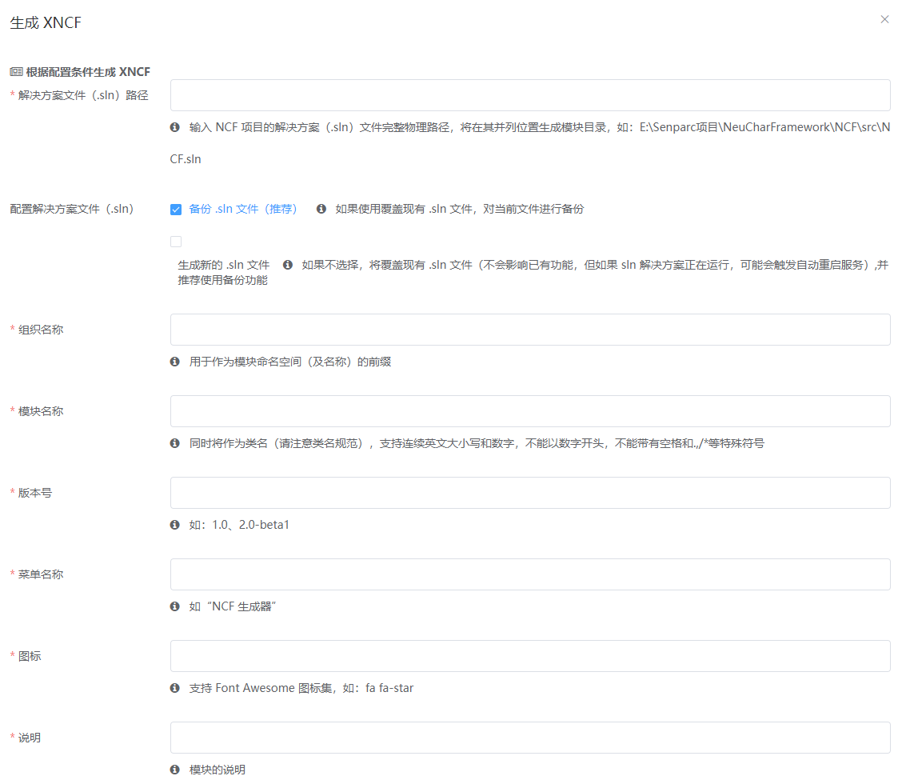
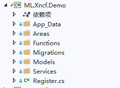
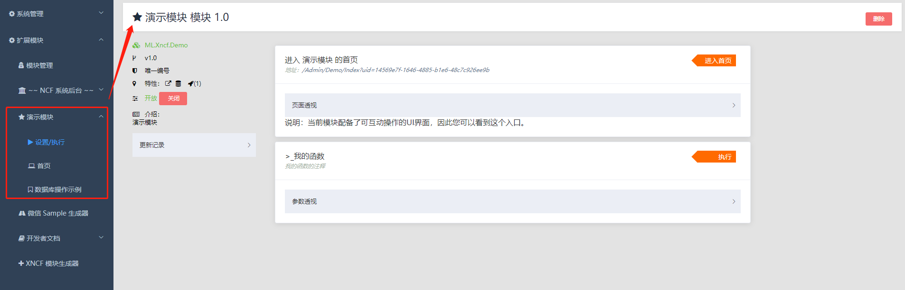
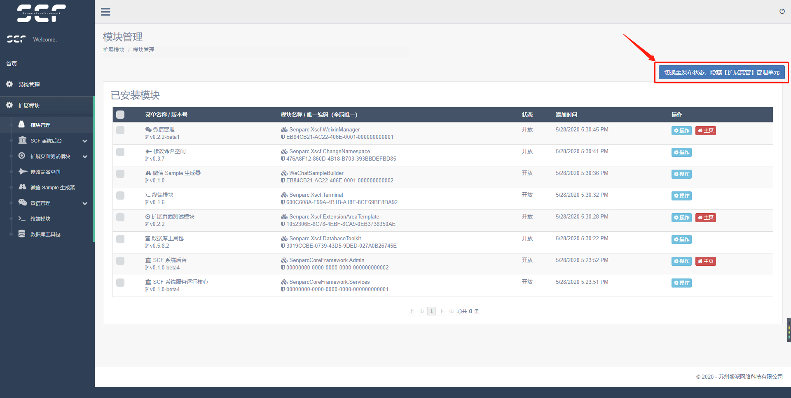
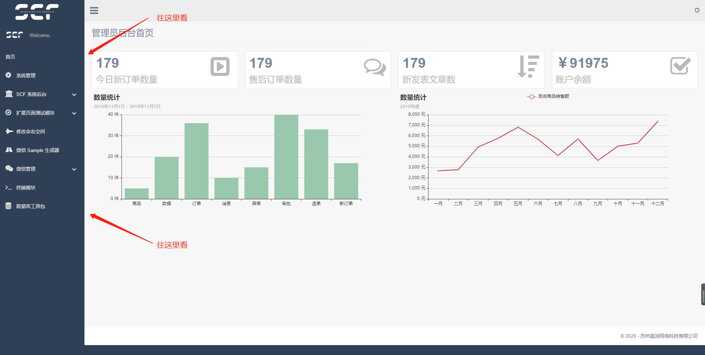
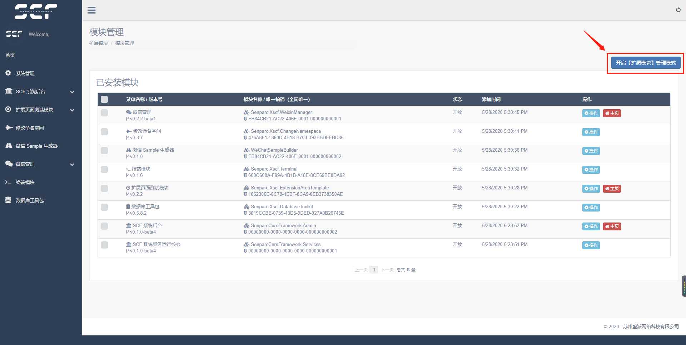

# 新功能

## 模块安装状态

待审核状态：


已安装状态：


已删除状态：


## 一键生成Xncf模块

进入 `NCF` 模块管理，可以看到新发现的模块



点击执行



显示执行表单



```
解决方案文件（.sln）路径: `C:\Code\NCF\ncf.sln`
配置解决方案文件（.sln）: `默认即可`
组织名称： `ML`
模块名称： `Demo`
版本号： `1.0`
菜单名称： `演示模块`
图标： `fa fa-star`
说明： `这是演示的一个模块`
功能配置： `根据需要选择`
安装 Sample： `根据需要选择`
```

生成的项目目录结构



安装后的模块展示



## 一键隐藏扩展模块的菜单项

对于有强迫症的开发小伙伴来说，多一层菜单可谓是脑壳疼，那么下面新发布了一个超强功能，让界面一键变美



效果如下：



这个效果对于客户来说可谓绝佳！

## 一键还原(开启)扩展模块的菜单项

对于开发来说难免还需要再次进行安装其他的模块，进行调试，跟踪，那么如何还原呢？

重新访问：http://你的域名/Admin/XncfModule/Index



点击开启即可，是不是 So Easy.

(更多功能敬请期待...)
