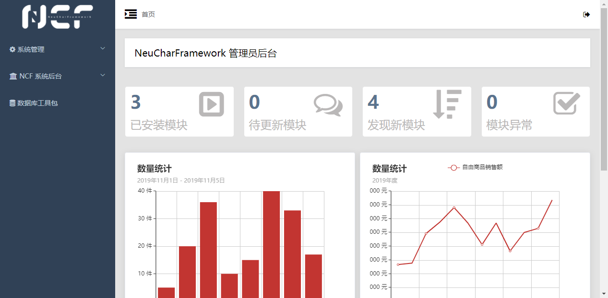

## 模块管理

打开【扩展模块】>【模块管理】，即可看到针对所有模块的管理页面：

在【模块管理】页面中，可以看到新模块和已安装的模块，其数字同时会反应在后台 `首页` 上。

在“已安装”的模块下面，可以看到两个已经默认由系统安装上的模块：

| 名称                 | 说明                                                                |
| -------------------- | ------------------------------------------------------------------- |
| NCF 系统后台         | 当前正在运行的管理员后台模块                                        |
| NCF 系统服务运行核心 | 核心逻辑（Service）层的模块，其中也包含了对数据模型的一些特殊的处理 |

> 说明：这两个模块是系统核心模块，类似操作系统的核心文件，如果您没有更好的模块取代之，请勿删除（虽然为了提供一个提供高可塑性的系统，我们赋予了操作人员这个权限）。

## 举例：数据库管理模块安装和使用

由于 NCF 的模块化，所有的系统功能、辅助功能，都以“模块”的形式出现，并无缝集成到系统中进行服务。

### 安装数据库工具包

在“新发现”的模块中，我们可以选择需要使用的模块进行安装，这里以比较常用的数据库工具“数据库工具包”为例：

此模块提供了常见的数据库备份、定时备份、SQL 导出等功能。

点击右侧的【安装】按钮，即可完成安装：

可以看到：左侧菜单已经自动添加了“数据库工具包”菜单，并且当前无法执行任何的方法（函数/Function），这是因为出于安全和实用性考虑，我们给所有的模块加了一把“锁”，当您确认此模块没有问题后，点击【开启】按钮，即可正式开启此模块。

> 提示：左侧菜单的“数据库工具包”周围有 `~~` 符号围绕，表明此模块未开启，在`正式运行状态`下不会出现在菜单中。

### 启用数据库工具包

开启后，即可使用所有功能：

### 备份数据库

例如当我们需要备份数据时，点击【备份数据库】右侧的【执行】按钮，然后填写需要存储备份文件的物理路径：

点击【执行】按钮，即可完成备份：

同时可以看到文件已经储存到指定的目录下：

### 定时备份数据库

除了手动备份，更加实用的功能是定时给数据库做备份，点击【设置参数】功能的【执行】按钮，并设置自动备份的周期（分钟），以及备份路径：

点击【执行】按钮，即可完成参数设置。此参数会自动保存，随时可以进行修改。备份路径也会自动显示在“备份数据库”功能下的输入框中。

此时可以看到已经完成第一次备份的文件：

等待 15 分钟后，可以看到最新的备份文件，并且上一次备份的文件自动重命名成 `*.last.bak`：

> 提示：这里将上一次的备份再进行一个备用的用意，在于有时开发过程中的错误不是马上能发现的，如果当发现的时候，备份已经是错误的数据或数据结构了，那已经为时过晚，此时可以使用 `.last.bak` 快速还原到再上一次的数据库状态。

## 删除模块

打开某个模块的管理页面后，右上角就有“删除”按钮，可对模块进行删除。

> 提示：模块删除后，会再次出现在“新发现”的模块列表里，可以重新进行安装，但此时模块的更新记录将会消失，模块之前的数据库记录是否留存取决于每个模块的设置。

## 切换“发布”状态

NCF 默认将“扩展模块”独立成一个一级菜单，方便了对扩展模块（XNCF）的管理，但是，
对于一个最终要发布到生产环境，并且交付给客户使用的系统来说，多一级菜单，并且夹杂着配置菜单和功能菜单，显然并不是一件优美的事情。

为此，NCF 同时配备了“一键起飞”的功能：快速将菜单和模块配置从设置状态（“停机坪”状态）切换到发布状态（“飞行”状态），要做到这一点，我们只需点击左侧菜单【扩展模块】>【模块管理】，看到右上角的【切换至发布状态，隐藏【扩展模块】管理单元】按钮：

点击按钮，并注意查看提示：

点击确定，即可将所有扩展模块目录整理到一级目录，并且隐藏【模块管理】的入口：

## 还原到模块管理模式

由于【模块管理】目前是隐藏的状态，因此需要手动输入 URL，进入到管理模块 `/Admin/XncfModule/`，如：

> https://localhost:44311/Admin/XncfModule/

此时的【模块管理】，能够看到右上角有一个【开启【扩展模块】管理模式】的按钮：

点击按钮并确认后，即可还原到模块编辑状态。
