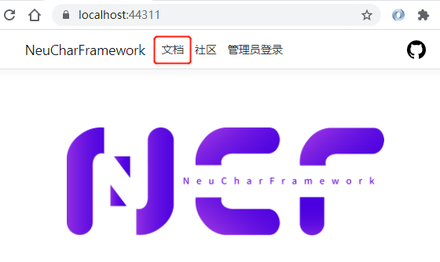
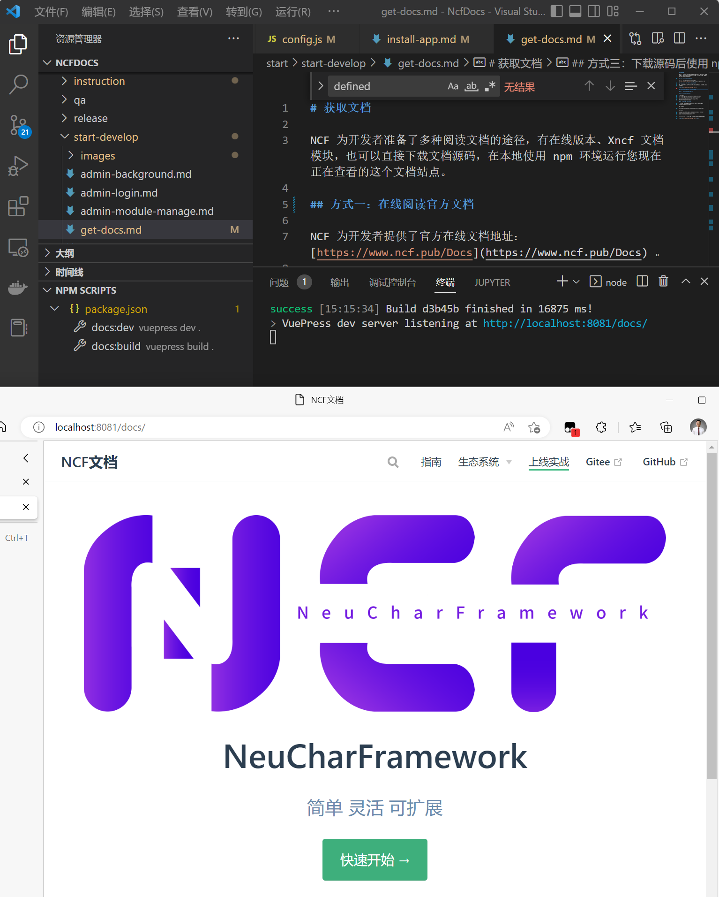

# 获取文档

NCF 为开发者准备了多种阅读文档的途径，有在线版本、Xncf 文档模块，也可以直接下载文档源码，在本地使用 npm 环境运行您现在正在查看的这个文档站点。

## 方式一：在线阅读官方文档

NCF 为开发者提供了官方在线文档地址：[https://doc.ncf.pub](https://doc.ncf.pub/) 。

## 方式二：在 NCF 站点中进入官方文档

运行 NCF 站点，进入根目录，点击顶部【文档】按钮，即可进入官方文档：



## 方式三：下载源码后使用 npm 本地运行

### 第一步：安装 node/npm 环境

### 第二步：下载文档源码

源码地址：

1. [https://github.com/NeuCharFramework/NcfDocs](https://github.com/NeuCharFramework/NcfDocs) （最新）
2. [https://gitee.com/NeuCharFramework/NcfDocs](https://gitee.com/NeuCharFramework/NcfDocs) （从 GitHub 同步，会有滞后）

假设本目录本地物理路径为：E:\Senparc项目\NeuCharFramework\NcfDocs

### 第三步：运行 npm 命令

使用命令行工具（或PowerShell），进入 E:\Senparc项目\NeuCharFramework\NcfDocs\

运行命令：

```
E:\Senparc项目\NeuCharFramework\NcfDocs> npm doc:dev
```

运行结果

```
success [15:10:56] Build c5b69b finished in 9376 ms!
> VuePress dev server listening at http://localhost:8081/docs/
```

在浏览器中打开所显示的 URL ，即可在本地查看或调试文档：

<br>
