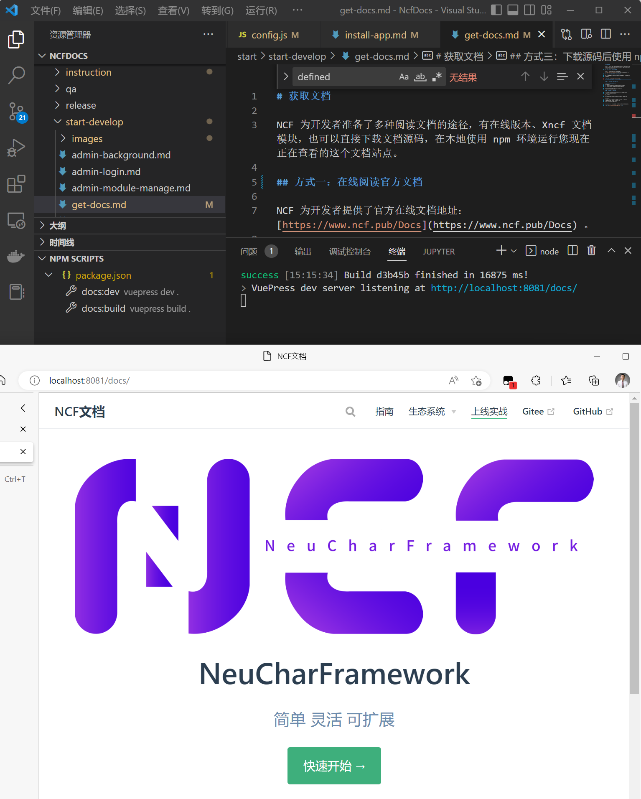

# 获取文档

NCF 为开发者准备了多种阅读文档的途径，有在线版本、Xncf 文档模块，也可以直接下载文档源码，在本地使用 npm 环境运行您现在正在查看的这个文档站点。

## 方式一：在线阅读官方文档

NCF 为开发者提供了官方在线文档地址：[https://doc.ncf.pub](https://doc.ncf.pub/) 。

## 方式二：在 NCF 站点中进入官方文档

运行 NCF 站点，进入根目录，点击顶部【文档】按钮，即可进入官方文档：


## 方式三：下载源码后使用 npm 本地运行

### 第一步：安装 node/npm 环境

### 第二步：下载文档源码

源码地址：

1. [https://github.com/NeuCharFramework/NcfDocs](https://github.com/NeuCharFramework/NcfDocs) （最新）
2. [https://gitee.com/NeuCharFramework/NcfDocs](https://gitee.com/NeuCharFramework/NcfDocs) （从 GitHub 同步，会有滞后）

假设本目录本地物理路径为：E:\Senparc项目\NeuCharFramework\NcfDocs

### 第三步：运行 npm 命令

使用命令行工具（或PowerShell），进入 E:\Senparc项目\NeuCharFramework\NcfDocs\

运行命令：

```
E:\Senparc项目\NeuCharFramework\NcfDocs> npm doc:dev
```

运行结果

```
success [15:10:56] Build c5b69b finished in 9376 ms!
> VuePress dev server listening at http://localhost:8081/docs/
```

在浏览器中打开所显示的 URL ，即可在本地查看或调试文档：

<br>

## 中文 Markdown 加粗与渲染验证

文档使用 VuePress 2 和 markdown-it。中文正文直接紧邻括号、引号或行内代码时，标准 Markdown 分隔符规则可能将 `**监督微调（SFT）**通过`、``**Rank（`r`，秩）**决定`` 的星号作为普通文字显示。

站点通过 VuePress 的标准 `extendsMarkdown` 扩展点启用 `markdown-it-cjk-friendly`，不修改框架源码，也不依赖手工插入空格或逐页改写 HTML。插件版本固定为 `2.0.3`，兼容当前 VuePress 2、markdown-it 14 和 Node.js 环境；仅扩展中日韩文字的强调规则，保留英文、转义星号、链接及代码块行为。正常编写加粗和行内代码即可，例如：

```markdown
**监督微调（SFT）**通过输入/答案样本学习期望响应。
**Rank（`r`，秩）**决定 adapter 的低秩维度。
```

更新依赖或渲染配置后，在文档仓库根目录执行：

```bash
pnpm install --frozen-lockfile
pnpm docs:test
pnpm docs:build
```

回归测试覆盖上述中文示例及完整英文微调教程。构建后还需检查网页中的 `<strong>` 和嵌套 `<code>`，而不是仅确认源码存在 `**`。重新部署构建产物后，线上页面才能使用新解析规则。
