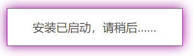
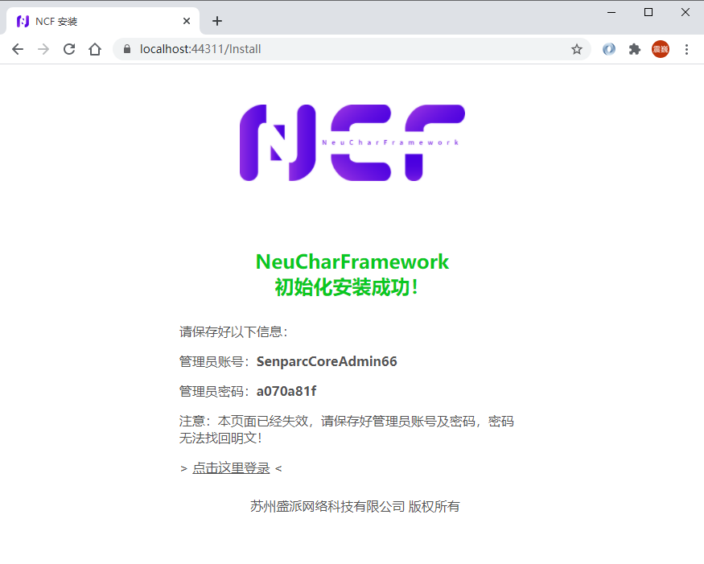

# 安装

## 开始安装

首次启动 NCF Web 项目时，系统会提示安装：

> 注意：默认运行的数据库为 SQLite，如需更换其他数据库，请查看《[使用多数据库](../database/mutil_database_support.html)》。

点击【立即安装】按钮前，可以展开【高级选项】确认将随首次安装提交的模块。
当前模拟站点默认选中以下 6 项：

- 后台管理模块（系统必需）
- `Senparc.Xncf.PromptRange`
- `Senparc.Xncf.XncfBuilder`
- `Senparc.Xncf.MCP`
- `Senparc.Xncf.AIKernel`
- `Senparc.Xncf.AgentsManager`

默认选择使用固定模块 UID，不依赖界面语言或显示名称。可按实际需求调整后，
点击【立即安装】：

等待过程中按钮会变成

系统会显示安装确认对话框。核对管理员、数据库和模块选择，确认后才会提交
安装请求；取消确认不会开始安装。安装完成后即可看到成功界面：

在成功界面上，可以看到随机生成的管理员账号、密码，及管理员登录入口

> 注意：此时必须立即复制或记录下“管理员账号”和“管理员密码"，密码使用不可逆加密方式储存，无法明文找回。

### 进阶：修改管理员账号和数据库连接字符串

您也可以在第一个安装界面上点击“高级选项>”按钮，修改管理员账号、数据库
连接字符串和可选模块：

随后即可看到安装好的系统使用了自定义的管理员账号：

## 登录管理员后台

在安装完成界面点击【点击这里登录】按钮链接，即可进入[管理员后台登录](./admin-login.html)页面。
