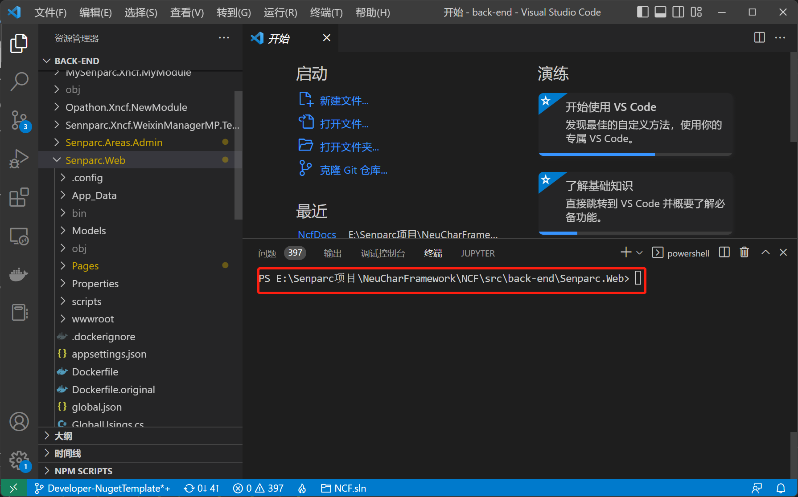

# 使用 CLI 运行 NCF

## 第一步：打开命令行工具或 Visual Studio Code

进入 NCF 的 Senparc.Web 项目（启动项目）所在目录路径：



> 提示：Visual Studio Code 中，按 <kbd>Ctrl + ~</kbd> 可以打开命令行工具。

## 第二步：输入 .NET 项目启动指令

```
E:\...\Senparc.Web > dotnet run --launch-profile http
```

> 注意：默认运行的数据库为 SQLite，如需更换其他数据库，请查看《[使用多数据库](../database/mutil_database_support.html)》。

## 完成启动

稍等数秒后，即可完成 NCF Web 项目的启动。

由于 CLI 命令行的一些行为特点，最后您可能会看到站点地址的提示，也可能会停留在系统启动日志上，这都是正常的：


使用上述命令时，在浏览器打开 `http://localhost:5000` 即可看到启动页面：


> 提示：本机 HTTPS profile 使用 `https://localhost:5111`；Docker profile 使用
> `http://localhost:5000` 和 `https://localhost:5001`。可以通过
> `--launch-profile` 明确选择，也可以修改 `launchSettings.json`。

## 首次启动安装

当第一次启动时，系统会自动提示[安装](./install-app.html)，安装完成后，安装界面将不再出现。
