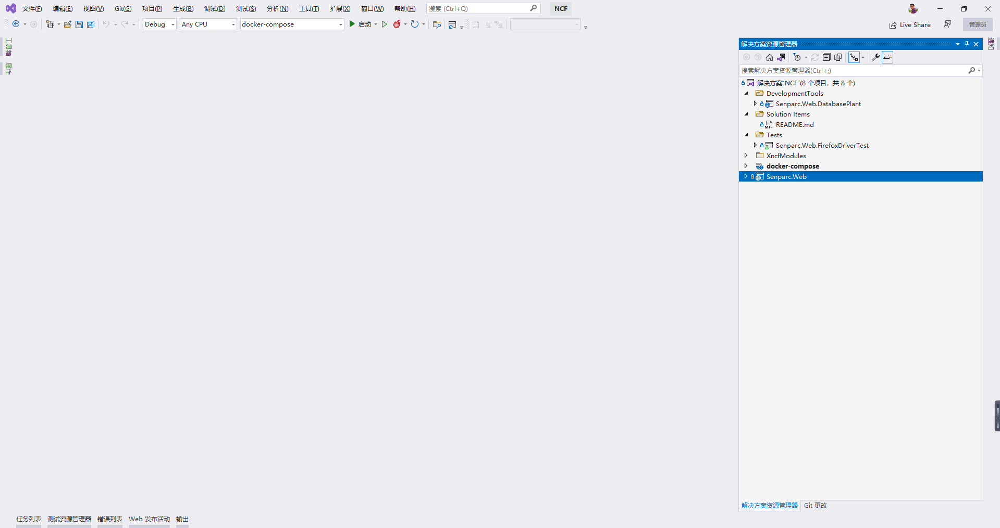
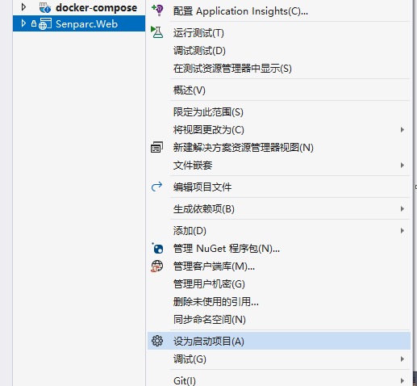

# 使用 Visual Studio 运行 NCF

## 第一步：打开解决方案

[源码同步或解压](/start/start-develop/get-ncf-template.html)完成后，打开 `/src/NCF.sln` 解决方案文件，即可看到 NCF 完整的模板项目：

## 第二步：确认 Senparc.Web 为启动项目

`Senparc.Web` 项目是用于启动 Web 站点的项目，确认已经为启动项目（加粗），如果没有，则点击右键，选择【设为启动项目】。

## 第三步：运行

点击顶部菜单【编译】>【开始执行（不调试）】，或快捷键 <kbd>Ctrl/Command</kbd> + <kbd>F5</kbd>

> 注意：默认运行的数据库为 SQLite，因此您无需在此阶段配置数据库。如需更换其他数据库，请查看《[使用多数据库](/start/database/mutil_database_support.html)》。

## 完成启动

稍等数秒后，即可完成 NCF Web 项目的启动，当第一次启动时，系统会自动提示[安装](/start/start-develop/install-app.html)，安装完成后，安装界面将不再出现。
