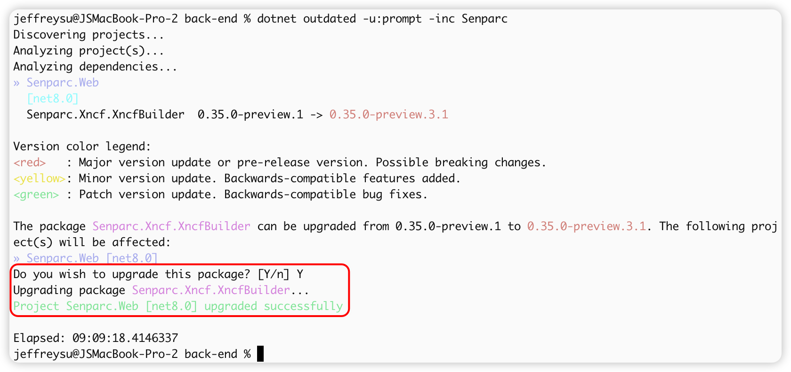
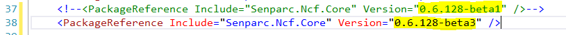

# 更新基础库

## 什么是更新基础库？

更新基础库的意思就是更新 NCF 中引用的底层核心库的 Nuget 版本，这些基础库大部分是 NCF 的基础库（如 XNCF 模块），也会包含部分第三方库。

## 如何更新基础库

### 更新基础库方法一：使用 IDE

> 以 Visual Studio 为例

第一步：打开解决方案(如 NCF.sln)


第二步：打开 Nuget 包管理器


第三步：搜索所有 `Senparc` 全家桶，并更新


> Nuget 本地包更新请见 [如何使用本地编译的基础库](#如何使用本地编译的基础库)

第四步：更新包


完成。

### 更新基础库方法二：使用命令行

第一步：打开命令行工具

Windows：打开 CMD 或 PowerShell 命令行。

MacOS：打开“终端”应用程序。

第二步：安装工具

```shell
dotnet tool install --global dotnet-outdated-tool
```

系统会为您自动安装 Nuget 升级工具，结束后会有提示，如：

```text
可使用以下命令调用工具: dotnet-outdated
已成功安装工具“dotnet-outdated-tool”(版本“4.6.8”)。
```

> 注意：工具只需要安装一次，除非需要升级，否则后续不需要重复安装

如果是 MacOS，可能会要求你多运行一条指令，将工具存入到环境变量中：命令行中复制 `export PATH="$PATH:/Users/jeffreysu/.dotnet/tools"` 并执行即可（注意：每个用户路径不同），如下图：


第三步：进入到 NCF 的解决方案目录中

命令行进入 NCF 的目录（有 \*.sln 文件的目录，即 Senparc.Web 文件夹的父层）。

第四步：检查并安装更新

输入：

```shell
dotnet outdated -u:prompt -inc Senparc
```


如果检测到更新，输入 Y，即可自动完成更新。



完成。

### 更新基础库方法三：手动更新（不推荐）

第一步:双击项目名称打开项目文件进行编辑


即可打开


第二步:找到你要想要更新的基础库的名称


第三步:打开 Nuget，将基础库的名字输入进去，查询库最新的版本号是多少


点击打开：


可以看到很多个版本，这里可以选择最新的：


第四步:修改项目文件中引用的基础库的版本号



完成。

## 如何使用本地编译的基础库

可以参考如何生成本地的 Nuget 包的步骤来操作[发布本地Nuget](/start/developer/issue_local_nuget.html)

生成本地的 Nuget 包以后，可以把需要引用的本地的 Nuget 包放到一个统一的文件夹，便于管理

使用上面 `如何更新基础库` 的方法，进行更新即可。

[基础库](/NcfPackageSources)
