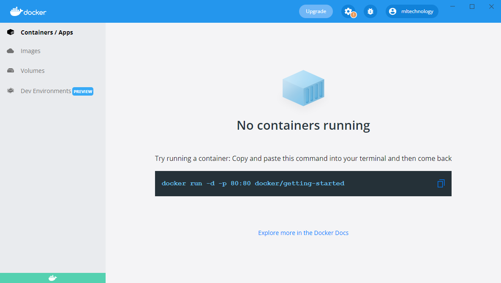
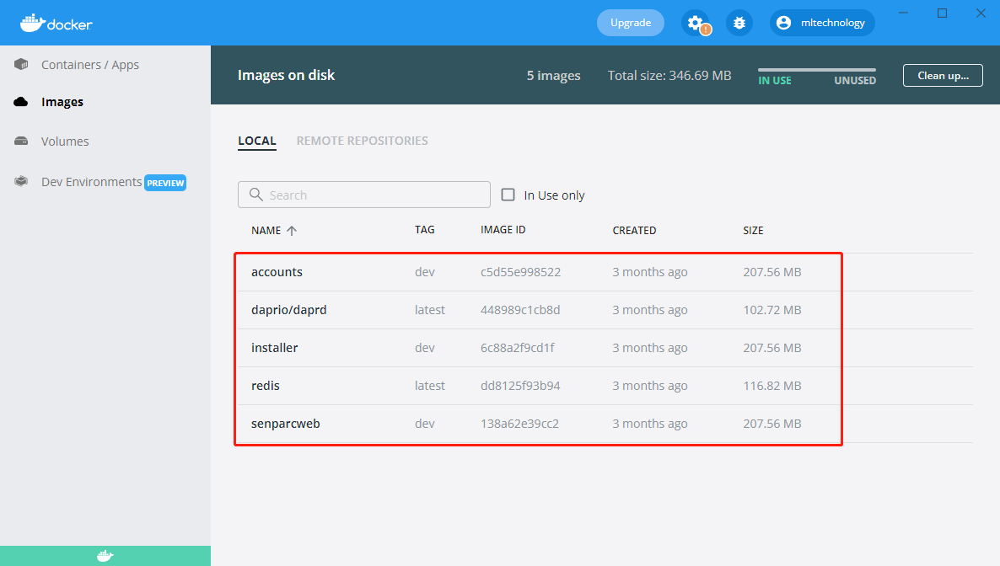

# Docker

Docker 是一个开源的应用容器引擎，让开发者可以打包他们的应用以及依赖包到一个可移植的镜像中，然后发布到任何流行的 Linux或Windows操作系统的机器上，也可以实现虚拟化。容器是完全使用沙箱机制，相互之间不会有任何接口。

## Docker配置

```
version: '3.4'

services:
  #mysql:
  #  image: mysql:latest
  #  ports:
  #   - "3307:3306"
  #  restart: always
  #  environment:
  #    MYSQL_ROOT_PASSWORD: "123456"

  redis:
    image: redis:latest
    ports:
    - "5379:6379"

  installer:
    image: ${DOCKER_REGISTRY-}installer
    build:
      context: .
      dockerfile: Senparc.Xncf.Installer/Dockerfile
    #depends_on:
    #  - mysql

  installer-dapr:
    image: "daprio/daprd:latest"
    command: [ "./daprd", "-app-id", "installer", "-app-port", "80" ]
    network_mode: "service:installer"
    depends_on:
      - installer

  accounts:
    image: ${DOCKER_REGISTRY-}accounts
    build:
      context: .
      dockerfile: Senparc.Xncf.Accounts/Dockerfile

  accounts-dapr:
    image: "daprio/daprd:latest"
    command: [ "./daprd", "-app-id", "accounts", "-app-port", "80" ]
    network_mode: "service:accounts"
    depends_on:
      - accounts

  senparc-client:
    image: ${DOCKER_REGISTRY-}senparcweb
    build:
      context: .
      dockerfile: Senparc.Web/Dockerfile
 
  senparc-client-dapr:
    image: "daprio/daprd:latest"
    command: ["./daprd","-app-id","senparc-client","-app-port","80"]
    network_mode: "service:senparc-client"
    depends_on:
      - senparc-client
```

## Windows环境运行Docker


点击图标运行



点击镜像查看



## 添加项目到Docker配置中


当添加了Docker的支持后，会在项目中生成一个Dockerfile的文件

```
#See https://aka.ms/containerfastmode to understand how Visual Studio uses this Dockerfile to build your images for faster debugging.

-- 使用dotnet6.0的sdk来进行编译
FROM mcr.microsoft.com/dotnet/aspnet:6.0 AS base
-- 设置工作目录为app
WORKDIR /app
-- 开放80端口
EXPOSE 80
-- 开放443端口
EXPOSE 443

-- 使用dotnet6.0的sdk来进行编译
FROM mcr.microsoft.com/dotnet/sdk:6.0 AS build
-- 将项目编译到src
WORKDIR /src
-- 复制Senparc.Web.csproj项目到Senparc.Web目录下
COPY ["Senparc.Web/Senparc.Web.csproj", "Senparc.Web/"]
-- 执行dotnet restore的还原包命令
RUN dotnet restore "Senparc.Web/Senparc.Web.csproj"
-- 复制所有的文件
COPY . .
-- 定位工作目录到/src/Senparc.Web下
WORKDIR "/src/Senparc.Web"
-- 执行dotnet build命令，将Release的环境build到app/build目录中
RUN dotnet build "Senparc.Web.csproj" -c Release -o /app/build

-- 重命名build为publish目录
FROM build AS publish
-- 执行dotnet publish命令，将Release的环境publish到app/publish目录中
RUN dotnet publish "Senparc.Web.csproj" -c Release -o /app/publish

-- 最后
FROM base AS final
-- 定位工作目录为app
WORKDIR /app
-- 从publish目录复制文件到app/publish
COPY --from=publish /app/publish .
-- 进入项目执行dotnet Senparc.Web.dll
ENTRYPOINT ["dotnet", "Senparc.Web.dll"]

```
