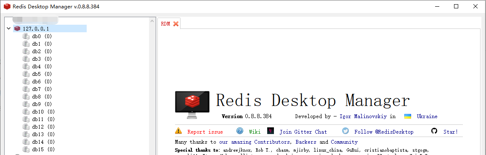

# 概述

Redis，相信大家都非常熟悉了

REmote DIctionary Server(Redis) 是一个由 Salvatore Sanfilippo 写的 key-value 存储系统，是跨平台的非关系型数据库。

Redis 是一个开源的使用 ANSI C 语言编写、遵守 BSD 协议、支持网络、可基于内存、分布式、可选持久性的键值对(Key-Value)存储数据库，并提供多种语言的 API。

Redis 通常被称为数据结构服务器，因为值（value）可以是字符串(String)、哈希(Hash)、列表(list)、集合(sets)和有序集合(sorted sets)等类型。

## 如何配置Redis

首先找到`Senparc.Web` 项目下的appsetting.json文件

配置好以后，我们可以运行程序，看一下Redis的变化

## 打开Redis管理工具

可以看到

