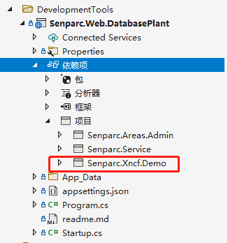

# 停机坪操作数据库迁移和更新

## 修改数据库配置文件

> 修改 `Senparc.Web\App_Data\DataBase\SenparcConfig.config` 文件中的 `Local-SqlServer` 节点

	<SenparcConfig>
		<Id>3</Id>
		<Name>Local-SqlServer</Name>
		<!--本地Demo默认数据库（可在appsettings.json中修改DatabaseName配置）-->
		<ConnectionStringFull><![CDATA[Server=PC-20210411JFTZ;initial catalog=NCF;integrated security=True;MultipleActiveResultSets=True;App=EntityFramework]]></ConnectionStringFull>
		<!--容器内使用需要使用IP-->
		<!--<ConnectionStringFull><![CDATA[Server=172.17.160.1; initial catalog=NCF;User ID=sa; Password=2wsx@WSX;MultipleActiveResultSets=True;App=EntityFramework]]></ConnectionStringFull>-->
		<ApplicationPath><![CDATA[/]]></ApplicationPath>
	</SenparcConfig>

> 找到自己的模块中定义数据库的配置文件 `Senparc.Xncf.Demo\Senparc.Xncf.Demo.csproj` ,修改节点 `Local-SqlServer`

	<SenparcConfig>
		<Id>2</Id>
		<Name>Local-SqlServer</Name>
		<!--本地Demo默认数据库（可在appsettings.json中修改DatabaseName配置）-->
		<ConnectionStringFull><![CDATA[Server=PC-20210411JFTZ;Database=NCF; initial catalog=NCF;integrated security=True;MultipleActiveResultSets=True;App=EntityFramework]]></ConnectionStringFull>
		<ApplicationPath><![CDATA[/]]></ApplicationPath>
	</SenparcConfig>

> 找到停机坪定义数据库的配置文件 `Senparc.Web.DatabasePlant\App_Data\Database\SenparcConfig.config` ,修改节点 `Local-SqlServer`

	<SenparcConfig>
		<Id>2</Id>
		<Name>Local-SqlServer</Name>
		<!--本地Demo默认数据库（可在appsettings.json中修改DatabaseName配置）-->
		<ConnectionStringFull><![CDATA[Server=.\;Database=NCF; initial catalog=NCF;integrated security=True;MultipleActiveResultSets=True;App=EntityFramework]]></ConnectionStringFull>
		<ApplicationPath><![CDATA[/]]></ApplicationPath>
	</SenparcConfig>

## 原数据库表结构

## 停机坪引用需要迁移的模块

## 使用模块生成器的迁移命令

生成完成后，会显示

## 对比数据库

| 图片 | 状态 |
| --- | --- |
|  | 更新前 |
|  | 更新后 |

