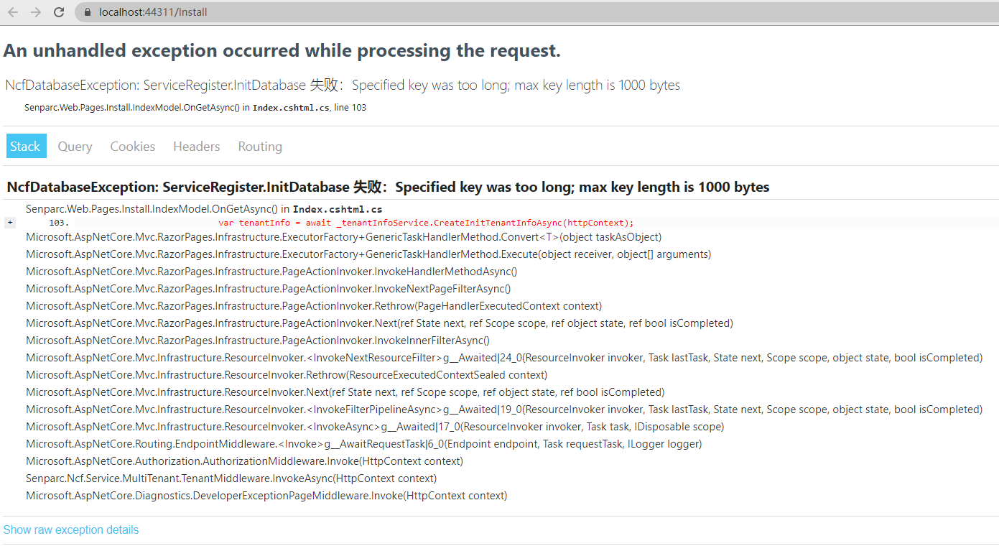

# NCF常见问题

## 修改Mysql的配置后，启动报错



解决方案请参考：[如何切换Mysql](/start/database/appoint_database.html)

## 如何修改默认数据库连接字符串

1.打开文件 /src/Senparc.Web/App_Data/Database/SenparcConfig.config 文件

2.直接编辑 `<ConnectionStringFull>` 节点下的连接字符串，例如：

    <ConnectionStringFull>
        <![CDATA[Server=.\;Database=NCF;User ID=sa;Pwd=sa;Trusted_Connection=True;integrated security=True;]]>
    </ConnectionStringFull>


注意：

1、不需要修改其他任何内容，其他设置日后会另作他用，乃为黑客设置“迷宫”而设。

2、正式版发布后，此连接字符串将会被加密，我们会提供加密工具。

## 创建自定义 Xncf 模块后，报错“rzc generate exited with code -2147450730”


解决方案：安装 `sdk dotnet 2.1`

下载地址：https://dotnet.microsoft.com/en-us/download/dotnet/2.1


## .NET CLI 命令 `dotnet ef` 执行报错

错误信息：
```
Could not execute because the specified command or file was not found.
Possible reasons for this include:
  * You misspelled a built-in dotnet command.
  * You intended to execute a .NET Core program, but dotnet-ef does not exist.
  * You intended to run a global tool, but a dotnet-prefixed executable with this name could not be found on the PATH.
```

解决方案：
使用的命令为
```
dotnet ef database update
```
查看当前dot版本为3.0

解决办法：

需要更新 `dotnet tool`，使用的命令为：
```
dotnet tool update --global dotnet-ef --version 3.0.0-preview7.19362.6
```
执行此命令之后再更新数据库就执行成功了。

[参考地址:https://blog.csdn.net/topdeveloperr/article/details/101282099](https://blog.csdn.net/topdeveloperr/article/details/101282099)

## NCF如何调试

[参考地址:https://www.cnblogs.com/szw/p/debug-remote-source-code.html](https://www.cnblogs.com/szw/p/debug-remote-source-code.html)

## 后台UI框架

[参考地址:https://element.eleme.cn/#/zh-CN](https://element.eleme.cn/#/zh-CN)

## 图标参考

[参考地址:https://colorlib.com/polygon/gentelella/icons.html](https://colorlib.com/polygon/gentelella/icons.html)

## 模块化：不同模块是通过什么方式传递数据的

模块本身还是由类和方法构成的，一些关键的方法（Functions、Services、WebApis，等等），都是可以在代码层面调用的，如果要通过http(s)来调用，那一般就是用 WebApi，通过 Json 传递。

## 使用2021-03-28以后的Developer/master分支版本在使用XncfBuilder模块后，执行生成，并未生成任何内容

原因及解决方案：

 1. 代码不是最新的：请[拉取最新的代码](/start/start-develop/get-ncf-template)。

 2. 本地未安装XNCF命令：

 打开命令行工具，命令行中执行：

```
dotnet new install Senparc.Xncf.XncfBuilder.Template
```

注：.NET 7 runtime 之前的 CLI 命令需要使用 `--install`：

```
dotnet new --install Senparc.Xncf.XncfBuilder.Template
```

执行完成后会看到以下内容


在根据[XncfBuilder模块](/start/xncf-develop/create-xncf.html)去生成模块，以下图片中选本地已安装即可


3. .NET 7 的 CLI 有一个生成模板的 bug，请等待官方修复，或使用 .NET 6.0 的 CLI。