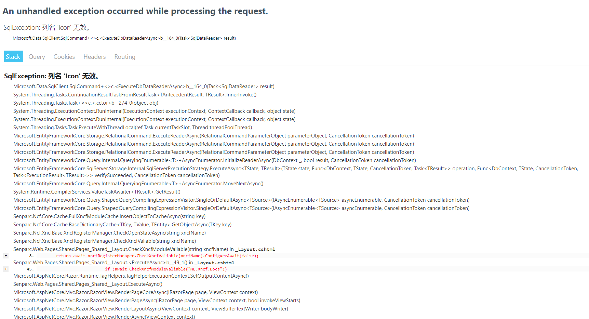
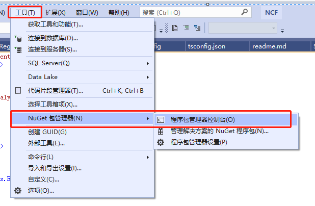
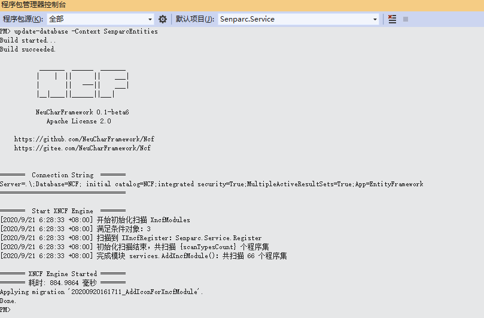

# 升级指导

NCF已经发布新的beta5，本次更新了底层的数据库、重构了数据库同步的方法、更新了文档模块，如果新项目建议用新的模板，老项目可以手动更新数据库

## `v0.3.5**-beta1` 升级到 `v0.3.600-beta1`

直接运行NCF站点可能的报错

1、更新最新NCF项目代码

2、将 `Senparc.Service` 项目设为启动项目

3、在 【程序包管理器控制台】选中 `Senparc.Service` ，然后输入：`update-database -Context SenparcEntities` 回车

4、完成，无需其他操作，重新运行，又回到了熟悉的画面

