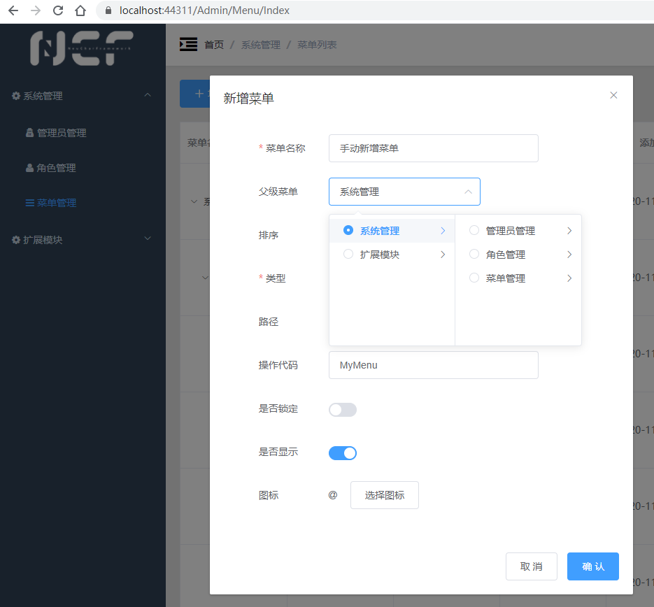
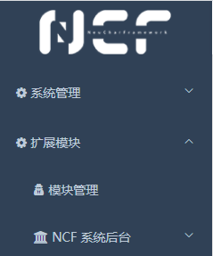

# 管理员后台

登录成功后，即可进入到管理员后台。

## 首页

管理员后台首页，包含了各类模块的统计信息，包括`已安装模块`、`待更新模块`、`新发现模块`、`异常模块`等。

## 模块状态

各模块状态含义如下：

状态    |     说明
--------|-----------
已安装  |  已经完成安装的 XNCF 模块
待更新  |  已经完成安装，并且发现了新版本的 XNCF 模块
新发现  |  已经扫描到模块的 dll 文件，但是并没有安装到系统的 XNCF 模块
异常    |  出现异常的 XNCF 模块，例如已经完成安装，但是 dll 未找到

## 系统管理菜单

左侧菜单中，展开【系统管理】，可以看到默认的 3 个菜单：管理员管理、角色管理、菜单管理。其中：

- `管理员管理` 用于分配可登录管理员后台的管理员账号、密码及角色

- `角色管理` 用于设置具备不同权限组合的角色，不同的角色可以赋予不同的管理员

- `菜单管理` 可用于手动管理左侧菜单的条目，同时也包括对页面和按钮权限的控制，支持多级菜单。
    > 提示：“菜单管理”的功能除了涵盖对左侧菜单的控制以外，也可以定义页面和按钮，这些页面和按钮，可以在“角色管理”中被角色精确管控。

例如，我们可以手动新增一个菜单，定义名称、父级菜单、页面路径等信息：

完成保存后，我们惊奇地发现：左侧菜单并没有变化？不要急着说 WTF，我们转到“角色管理”，打开“超级管理员”的权限，真相就在这里：

出于安全考虑，手动新增的所有元素不会自动添加到权限中，当我们选中新菜单，并确认保存后，即可看到新增的【手动新增菜单】：

## 扩展模块菜单

`扩展模块` 菜单用于管理所有的模块（XNCF）。

其中，`模块管理` 是系统页面，除此以外的菜单都是安装完模块之后，自动在菜单中出现的，如已经more安装好的模块：`NCF 系统后台`，就是正在运行的这个后台（后台也是一个模块）。

> 提示：由于 NCF 高度模块化的架构，整个站点的绝大多数功能都运行在模块上，使用模块管理模块、基于模块运行模块、用模块生成模块。
