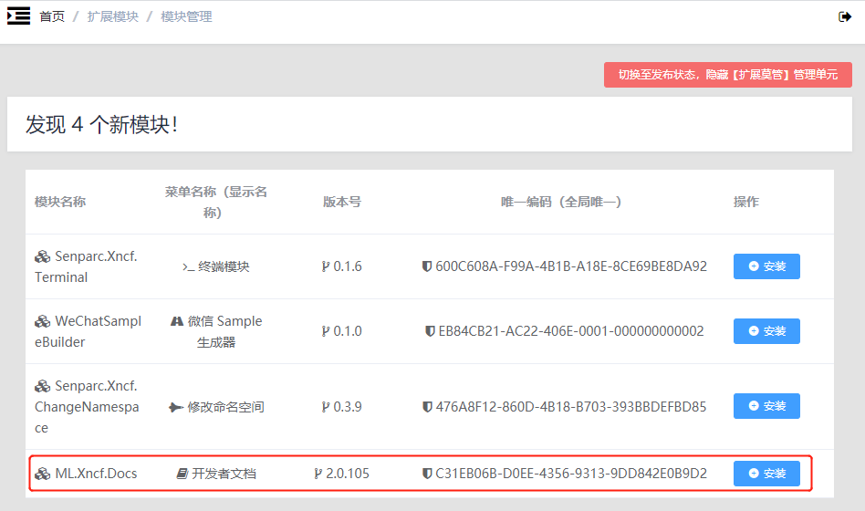
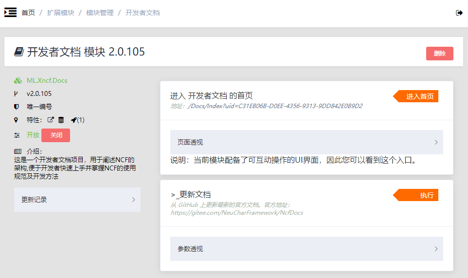
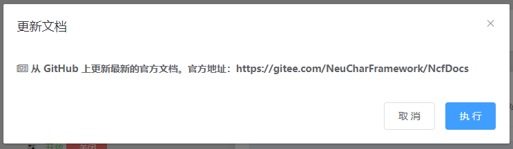
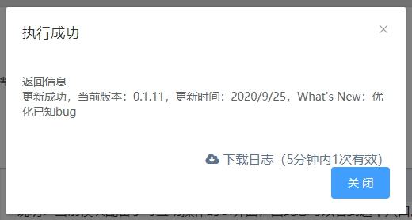
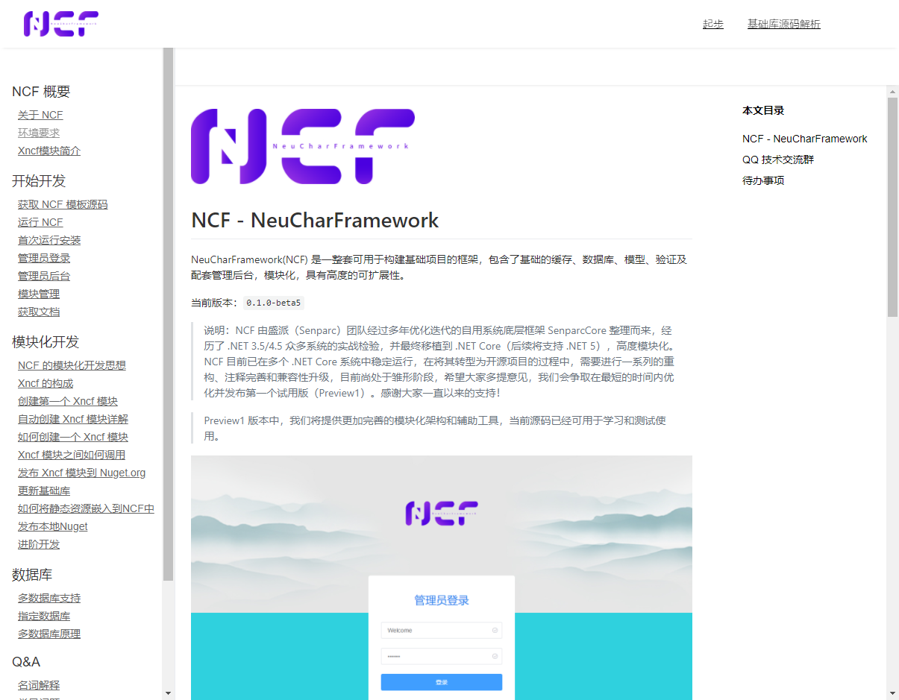
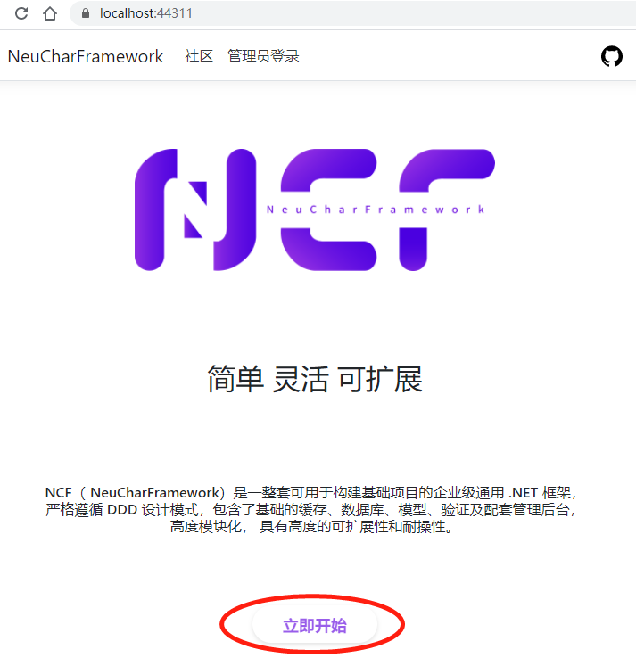
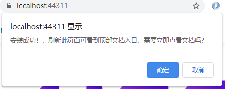
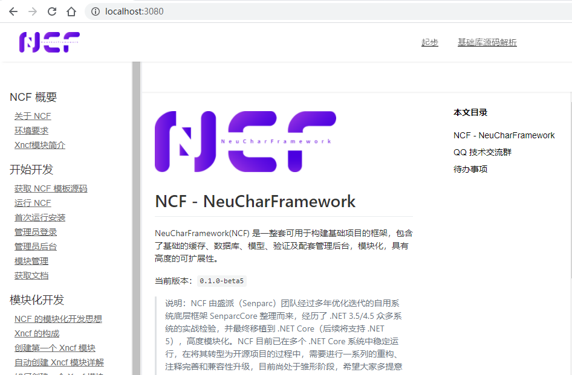

# 获取文档

NCF 为开发者准备了多种阅读文档的途径，有在线版本、Xncf 文档模块，也可以直接下载文档源码，在本地使用 npm 环境运行您现在正在查看的这个文档站点。

## 方式一：在线阅读

NCF 为开发者提供了官方在线文档地址：[https://www.ncf.pub/Docs](https://www.ncf.pub/Docs) 。

## 方式二：在 NCF 站点中查看文档

运行 NCF 站点，打开【模块管理】，找到 `开发者文档（ML.Xncf.Docs）`：

> 提示：如果没有看到此模块，可以从 Nuget 安装包：`ML.Xncf.Docs`。




进行安装并开启：



“开发者文档” 模块中提供了一个网页版文档的入口，以及“更新文档”的执行方法。

点击“更细文档”的【执行】按钮，弹出提示框：



其中提示了文档内容的的开源地址，继续点击【执行】，稍等片刻，即可自动完成文档更新，此操作可以在任意时间进行。



回到设置页面，点击【进入首页】即可查看和本站相同的文档站点，并包含最新的文档内容：



安装完成后，可以在首页顶部菜单看到文档的快捷入口：


### 小技巧
> 如果不使用后台安装，您也可以在安装完成 NCF 后，进入整站的首页（如：https://localhost:44311/），然后点击首页的【立即开始】按钮：<br>
> <br>
> 查看提示并点击确认，即可快速完成文档安装。<br>
> <br>

## 方式三：下载源码后使用 npm 本地运行

### 第一步：安装 node/npm 环境

### 第二步：下载文档源码

源码地址：https://gitee.com/NeuCharFramework/NcfDocs

假设本目录本地物理路径为：E:\Senparc项目\NeuCharFramework\Gitee-NcfDocs

### 第三步：运行 npm 命令

使用命令行工具（或PowerShell），进入 E:\Senparc项目\NeuCharFramework\Gitee-NcfDocs\cn 目录（注意后面后一个 **cn** 目录）

运行命令：
```
E:\Senparc项目\NeuCharFramework\Gitee-NcfDocs\cn> npm i
```
运行结果
```
E:\Senparc项目\NeuCharFramework\Gitee-NcfDocs\cn> npm i
npm WARN dongjian-doc-website@1.0.0 No repository field.
npm WARN dongjian-doc-website@1.0.0 No license field.

audited 31 packages in 1.912s
found 0 vulnerabilities

E:\Senparc项目\NeuCharFramework\Gitee-NcfDocs\cn>
```

运行命令：
```
 E:\Senparc项目\NeuCharFramework\Gitee-NcfDocs\cn> npm run dev
```
运行结果
```
E:\Senparc项目\NeuCharFramework\Gitee-NcfDocs\cn> npm run dev

> dongjian-doc-website@1.0.0 dev E:\Senparc项目\NeuCharFramework\Gitee-NcfDocs\cn
> node server.js

Server running on 3080...
```

在浏览器中打开 http://localhost:3080 ，即可在本地查看或调试文档：

> <br>
