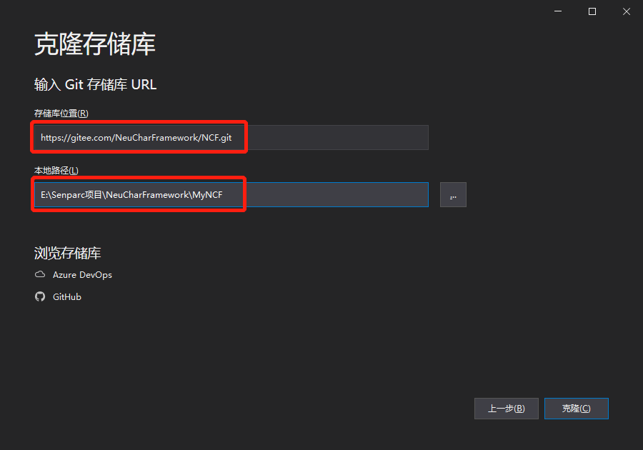

# 获取 NCF 模板源码

## 从命令行安装（推荐）

在已经安装了 .NET 运行时的开发环境中打开命令行，输入：

```
dotnet new install Senparc.NCF.Template
```
> 如果你本地的.NET SDK版本大于6.0.100，那么就需要使用 `dotnet new --install Senparc.NCF.Template`命令安装即可。

安装成功后，客户端提示：


进入需要创建项目的文件夹，输入命令：

```
dotnet new NCF -n MyProject
```


> 其中，`MyProject` 为项目名称，可根据需要修改，如果不提供 `-n` 参数，则使用默认名称创建。


## 从源码地址获取源码

以 Gitee 为例，还有几种从开源项目库获取源码的方式：

以下两个代码托管地址，为 NCF 官方代码发布渠道：

 - GitHub：[https://github.com/NeuCharFramework/NCF](https://github.com/NeuCharFramework/NCF)

 - Gitee：[https://gitee.com/NeuCharFramework/NCF](https://gitee.com/NeuCharFramework/NCF)


### 方式一：直接下载 .zip 包

打开项目源码地址，点击【克隆/下载】按钮，点击【下载ZIP】按钮，即可完成NCF源码下载


下载完成后，解压到指定地址即可。

### 方式二：使用 Git 同步到本地

打开项目源码地址，点击【克隆/下载】按钮，点击【复制】按钮，即可获得 git 地址，如：
> https://gitee.com/NeuCharFramework/NCF.git


打开 Visual Studio，点击【克隆储存库】：


将 git 地址粘贴到【储存库位置】，并设置用于存放源代码的【本地路径】，然后点击【克隆】按钮：



### 方式三：先 Fork，后同步 Git（推荐）

打开项目源码地址，点击右上角【Fork】按钮，将官方源码在自己的账户下做一个副本，然后在自己的副本项目下，重复上述“方式二”：


> 注：Fork 的库不会自动同步官方的源码，如需获得最新的源码，需要手动再次同步。
