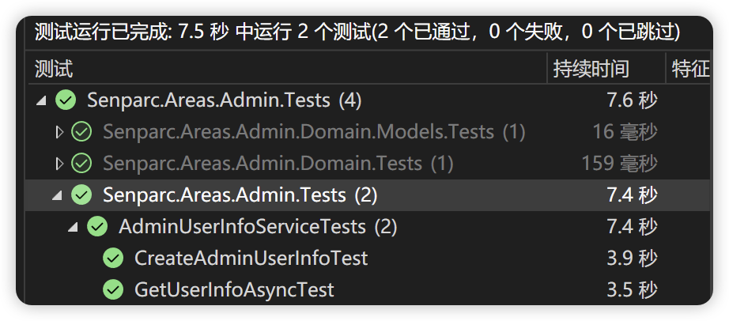

# 进阶

## 进阶：生成种子数据

常规的系统测试、集成测试过程中，测试人员通常需要为数据库插入大量数据，这一过程费时费力，目前实际操作过程中，大量的单元测试（或开发人员的测试）也会重复类似过程。NCF 为开发者提供了几位友好的 Seed Data（种子数据）载入功能，无需使用数据库，可直接在内存中完成所有加载和测试。

种子数据的来源可以是在内存中直接创建新的对象，也可以来自于文件、数据库、缓存等持久化的存储容器，以下是一种实现的方式。

在单元测试类中，创建一个静态方法：

```csharp
private static Action<Dictionary<Type, List<object>>> InitSeedData = seedData =>
{
    var list = new List<object>();
    Random rand = new Random();
    for (int i = 0; i < 1000000; i++)
    {
        var username = $"Admin-{i}";
        var password = $"pWd-{i}";
        var realName = $"Admin{rand.Next(10000)}";
        var adminUserInfo = new AdminUserInfo(ref username, ref password, realName, "", "");
        list.Add(adminUserInfo);
    }
    seedData.Add(typeof(AdminUserInfo), list);
};
```

上述代码中 `seedData` 是 NCF 底层已经为你处理好的所有模拟数据的容器，您可以通过 `seedData[<Type>]` 快速获取或者设置某一个实体的模拟数据。通过 for 循环我们创造了 100 万条数据。

如何使这个配置种子数据的过程生效呢？

非常简单！我们可以直接为已经创造好的单元测试的构造函数，添加一个基类构造函数的调用 `base(null, InitSeedData)`：

```C#
public AdminUserInfoServiceTests() : base(null, InitSeedData)
{
    // 无需修改
}
```

然后我们创建一个单元测试来测试一下：

```C#
[TestMethod]
public async Task MyTestMethod()
{
    var obj = await adminUserInfoService.GetUserInfoAsync("Admin-600");
    Assert.IsNotNull(obj);

    var dataset = base.dataLists[typeof(AdminUserInfo)];
    Assert.AreEqual(dataset.Skip(600).Take(1).First() as AdminUserInfo, obj);
}
```

运行测试结果：



通过测试可以看到，100 万条数据加上整个单元测试类的初始化时间只占了 0.2 秒左右，模拟的查询过程默认使用 Linq 的 lambda 查询，使用了 4.3 秒，这取决于 CPU 的性能，如果只是为了测试业务逻辑，您也可以降低种子数据的条数，通常情况下 1000 条已经够用。