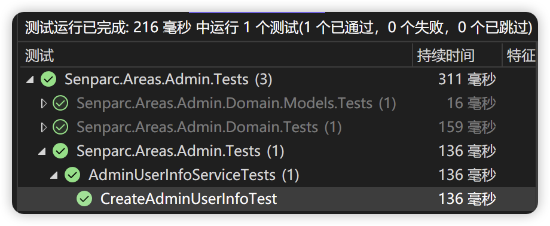

# 开始开发

## 准备工作

NCF 单元测试基于 .NET 官方的单元测试框架(MsTest)，因此您并不需要储备任何附加的技能。因此，您只需要安装 .NET 常规开发环境（.NET SDK）即可进行单元测试的开发和运行。

## 创建单元测试项目

您可以使用常规命令行的方式或 Visual Studio 中的单元测试项目模板来创建单元测试项目。

以 NCF 项目的 Admin 模块为例，您可以使用以下命令行来创建单元测试项目：

```shell
dotnet new mstest -n Senparc.Areas.Admin.Tests
```

## 为项目添加引用

单元测试项目需要引用被测试的项目，如当前示例中的 Senparc.Areas.Admin 项目：

```xml
<ItemGroup>
<ProjectReference Include="..\..\Senparc.Areas.Admin\Senparc.Areas.Admin.csproj" />
</ItemGroup>
```

其次，我们需要引用 NCF 的单元测试基基础支撑库：

```shell
dotnet add package Senparc.Ncf.UnitTestExtension
```

完成后可以看到 `Senparc.Areas.Admin.Tests.csproj` 中已经添加了相关的代码（您也可以手动添加），如：

```xml
<PackageReference Include="Senparc.Ncf.UnitTestExtension" Version="0.1.1.2-preview1" />
```

## 创建单元测试文件

您可以按照常规单元测试的规则，创建一个单元测试文件，如：

```C#
[TestClass]
public class AdminUserInfoServiceTests : BaseNcfUnitTest
{
}
```

> `BaseNcfUnitTest` 是 NCF 提供的单元测试基类，来自于上一步安装的 `Senparc.Ncf.UnitTestExtension` 包。

为了给整个 Service 提供公共的对象，我们可以添加一个构造函数和私有变量：

```C#
AdminUserInfoService adminUserInfoService;
public AdminUserInfoServiceTests()
{
    //创建 Repository 基类的 Mock 对象
    var mockBaseRepo = base.GetRespository<AdminUserInfo>().MockRepository;
    //由于 AdminUserInfoService 创建了专门的接口，从基类自动映射相关扩展接口，如果直接使用 IClientRepositoryBase<AdminUserInfo> 操作数据，则这一句可以省略
    var mockAdminUserInfoRepo = base.CreateMockForExtendedInterface<IAdminUserInfoRepository, IClientRepositoryBase<AdminUserInfo>>(mockBaseRepo);
    //生成 AdminUserInfoService 类
    adminUserInfoService = new AdminUserInfoService(mockAdminUserInfoRepo.Object, null, base._serviceProvider);
}
```

> 上述方法具有通用性，可举一反三，用于几乎所有 Service 和实体类

接下来我们就可以针对 `AdminUserInfoService` 中的所有方法进行测试，例如：

```C#
[TestMethod]
public async Task CreateAdminUserInfoTest()
{
    var adminUserInfoDto = new CreateOrUpdate_AdminUserInfoDto()
    {
        UserName = "NCF_Admin",
        Password = "abcd",
    };

    var obj = await adminUserInfoService.CreateAdminUserInfoAsync(adminUserInfoDto);

    Assert.IsNotNull(obj);
    Assert.AreEqual(adminUserInfoDto.UserName, obj.UserName);

    var storedPassword = obj.GetSHA512Password(adminUserInfoDto.Password, obj.PasswordSalt);
    Assert.AreEqual(storedPassword, obj.Password);
}
```

上述代码比较好理解：

- `adminUserInfoDto` 创建了一个用于创建管理员的 DTO 对象
- `adminUserInfoService.CreateAdminUserInfoAsync()` 方法是本单元测试的目标，用于实现管理员添加
- `Assert` 方法验证了期望结果

运行单元测试，显示测试通过：



