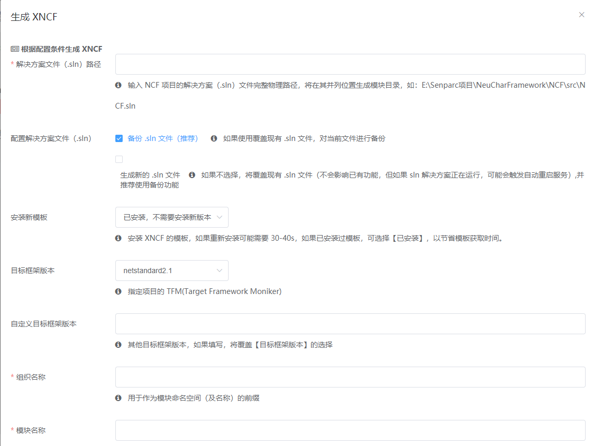

# 创建第一个 Xncf 模块

## 前言

创建 Xncf 模块有自动和手动两种方式：
 1. 手动方式即按照 [Xncf 的构成](/start/xncf-develop/about-xncf.html) 中的要求，创建 `Register` 类，并实现一系列的接口。
 > 手动创建方式可参考[这里](/start/developer/xncf_module.html)。
 2. 【推荐】使用 UI 可视化配置的方式自动创建模块。值得一提的是：这个用于创建 Xncf 模块的功能，也是由一个名为 Senparc.Xncf.XncfBuilder 的 Xncf 模块提供的。

以下使用“0 代码”创建的方式，对使用可视化自动创建 Xncf 模块基础代码的方式进行介绍。

## 安装 Senparc.Xncf.XncfBuilder

运行 NCF 项目，进入到 【模块管理】菜单，在“新发现模块”列表中，找到 `XNCF 模块生成器`（Senparc.Xncf.XncfBuilder），点击【安装】按钮：


安装后：


## 启用 Senparc.Xncf.XncfBuilder

点击【开启】按钮，启用此模块：


## 设置 Xncf 模块信息

点击【生成 XNCF】右侧的【执行】按钮，对将要生成的 Xncf 信息进行设置：



>  **提示**<br>
>  1. 所有参数都有说明，这里不再赘述，需要特别说明的是：<br>
> 【解决方案文件（.sln）路径】参数，可以输入当前正在运行的 NCF 的项目解决方案文件路径，也可以是其他任意的 NCF 项目的解决方案文件路径（例如有时我们会同时开发多个项目，使用多个解决方案）。新的 Xncf 模块项目会自动添加到指定的解决方案中，因为如此，如果指定的解决方案正在运行 Web 站点（如 IISExpress），那么会导致站点自动重启，因为解决方案文件会被修改。<br>
>  2. 上述输入的组织名称为 `MySenparc`，模块名称为 `MyApp`，因此可以推测，最终模块的全名为：`MySenparc.Xncf.MyApp`。<br><br>
> （本文以当前正在运行的 NCF.sln 为例。）

除了以上基础信息外，继续下拉，还可以看到【功能配置】选项，如需模块配置对应功能的基础代码（实现对应功能接口），即可勾选。


最下方是【安装Sample】的选项，如果您是第一次接触 NCF，强烈建议您勾选此选项，安装的 Sample 将会向您展示一个包含数据库、函数（Function）、网页的多功能的 Xncf 模块，便于您更加生动和具体地了解 Xncf 的构成和对应功能的实现。当然，除此之外，Sample 中的代码也可以为您创建自己的业务代码提供参考。

## 安装Xncf Module模板

首先检测一下Xncf Module模板是否有安装到本地


如果没有，就需要执行下面的命令来进行安装

```
dotnet new --install Senparc.Xncf.XncfBuilder.Template
```

安装完成后,再次执行`dotnet new`显示内容如下


> Nuget 地址：[https://www.nuget.org/packages/Senparc.Xncf.XncfBuilder.Template](https://www.nuget.org/packages/Senparc.Xncf.XncfBuilder.Template)

## 生成 Xncf

检查信息，确认无误后，点击【执行】按钮，0.5 秒左右，即可完成定制化 Xncf 项目的创建：


> **提示：** 由于当前设置的 .sln 文件就是当前正在运行的站点解决方案，因此，成功提示中的【下载日志】按钮将无效。

## 载入 Xncf 模块

回到 Visual Studio，当新的 Xncf 模块代码自动创建之后，会自动加入到 NCF.sln 解决方案中，因此可以看到这样的提示：


点击【重载】按钮，重新加载解决方案。

可以在【解决方案资源管理器】中看到，新的项目 `MySenparc.Xncf.MyApp` 已经被自动创建，到目前仍然是“0代码”：


## 安装并启用 MySenparc.Xncf.MyApp 模块

将“0代码”进行到底，直接按键盘 <kbd>Ctrl</kbd> + <kbd>F5</kbd> 运行 Senparc.Web 项目，并进入后台：


此时可以看到“发现新模块”统计数字由 3 变成了 4，点击这个标签，进入到【模块管理】页面，即可看到“发现新模块”列表中，出现了上述操作自动生成的 `MySenparc.Xncf.MyApp` 模块，菜单显示名称为 `自动生成地模块`，和设置的一致：


当我们点击右侧对应的【安装】按钮后，即可完成这个自定义模块的安装，不过在此之前，为了了解数据库的变化，我们先来看一下当前数据库的表（以 SQL Server 为例）：


回到网页，点击`MySenparc.Xncf.MyApp` 右侧的【安装】按钮，完成模块的安装，并点击【启用】按钮激活模块。

在“启用”之前，已经可以看到数据库表的变化：


安装过程自动为数据库添加了 2 张表：

表名  |  说明
------|---------
__MySenparc_MyApp__EFMigrationsHistory | EFCore 进行数据库迁移、升级的历史版本记录，由 EFCore 在进行迁移操作（Migration）时自动修改
MySenparc_MyApp_Color | 由于勾选了【安装Sample】的选项，此数据库是用于演示 Sample 中数据库操作的示例

> **提示：** 在自动生成的表名中，都可以看到 `MySenparc_MyApp` 这个前缀，这么做的好处是，即使不同的组织发布了名称相同的模块（如 `MySenparc.Xncf.MyApp` 和 `YourSenparc.Xncf.MyApp`），也可以很好兼容，不会发生冲突。

回到网页，可以看到已经启用状态的模块信息：


> **提示**<br>
> ①：可以看到支持网页的模块菜单，和之前未包含网页的菜单（如`数据库工具包`）多了一层目录，除了大家都有的 `设置/执行` 页面以外，还多了自定义的网页。<br>
> ②：在“特性”栏里面可以看到当前模块所支持的特性：网页、数据库、执行方法（Function）。<br>
> ③：拥有网页功能的 Xncf 模块没会被要求定义一个“首页”，可以在此页面上快速进入。


## 功能演示

在了解内部文件和原理之前，我们先来看一下这个 Sample 完成哪些功能的演示。

### 函数（Function）

> 函数功能用于完成一个简单的小粒度的操作，支持在 NCF 后台被可视化地操作，并可以使用代码调用执行。

打开模块设置的默认页面（即【设置/执行】菜单），即可看到右侧有【执行】按钮，每一个【执行】按钮都代表着一个函数（Function）：


> 提示：这个函数的功能将通过用户输入的参数进行自动的加减乘除及平方的计算。

点击“我的函数”右侧的【执行】按钮，即可弹出“我的函数”这个函数的可视化操作界面，其中定义了这个函数要求输入的所有变量，这些变量是可以通过代码自由设置的，实例中包括了名称、数字1、数字2、运算符，以及计算平方的选项。


填写信息并设置选项，以下配置将执行 `(2 × 3)²` 的计算


点击【执行】后，输出计算结果：


在结果页面上，我们还能看到有一个“下载日志”的链接，此日志只会在服务器缓存中暂存 5 分钟。下载并打开，可以看到日志中记录了完整的计算过程：


### 网页

> 网页功能使用了 ASP.NET 的页面 Area 的能力，每个 Xncf 模块都可以定义一个或多个 Area，当然也可以直接在根目录下创建页面。其开发过程和普通项目没有区别。


### 数据库

> NCF 为所有模块提供了多数据库的支持，并且支持多数据库之间的迁移。同时，NCF 也为数据库访问配置了一整套完善的基础方法。


